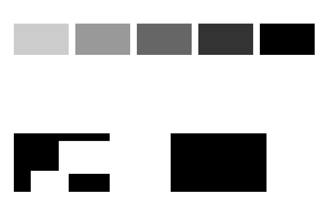
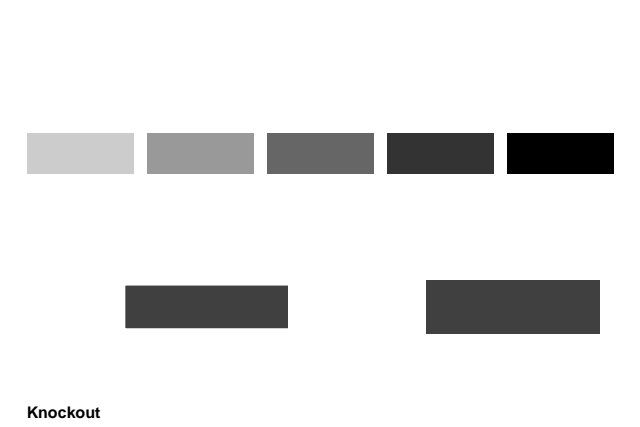
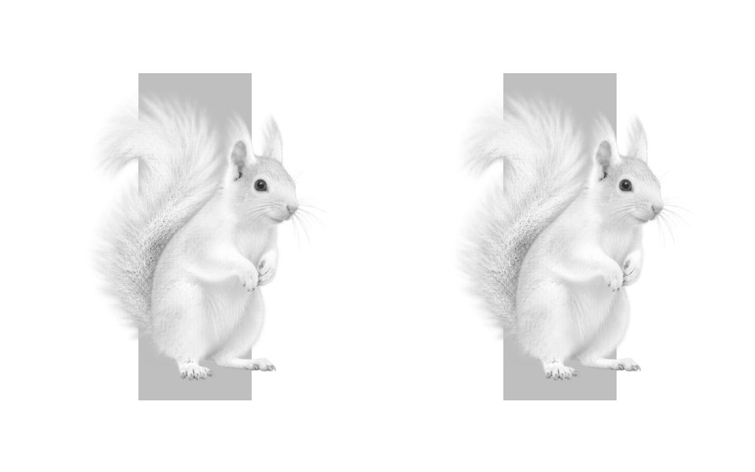

# Measuring print-plate coverage

`renderPdfPlateCoverage()` measures described ink amounts from a `PdfDocument`, including the result of `parsePdf(deliveredBytes)`. It returns one-byte grayscale samples and a matching PNG for each plate and page. Use these samples for tint assertions and the PNGs for visual evidence. For previews in the ink's own color, use [`previewPdfPlates()`](print-plates.md).

```ts
import { parsePdf } from "mondrian.pdf"
import { renderPdfPlateCoverage } from "mondrian.pdf/testing"

const evidence = await renderPdfPlateCoverage(parsePdf(deliveredBytes), {
	resolution: 144,
	permitColors: ["cmyk", "spot"],
})

for (const plate of evidence.plates) {
	for (const page of plate.pages) {
		// Rows begin at the top left, with exactly one byte per pixel.
		const sample = page.samples[y * page.width + x]!
		const coverage = 1 - sample / 255
		// page.png depicts the same samples as opaque grayscale.
	}
}
```

`resolution` defaults to 144 dots per inch and must be positive and finite. `permitColors` has the same meaning, discovery order, and validation rules as colored previews. Permitting CMYK always returns Cyan, Magenta, Yellow, and Black, even when empty; spots follow discovery order. Page numbers begin at one. Dimensions follow the renderer's page geometry, including rotation, and scale at `resolution / 72` pixels per PDF point, rounded up. Every page has exactly `width * height` samples and an opaque PNG with the same dimensions.

## Sample convention

The bytes measure inverse ink amount, independent of how bright or dark the ink looks on screen. A uniform opaque vector tint `t` maps to `round(255 × (1 − t))`, with half steps rounded toward white. An opaque 8-bit process-image sample `b` maps to `255 − b`.

| Ink amount     | Sample |
| -------------- | ------ |
| No ink / paper | 255    |
| 25%            | 191    |
| 50%            | 128    |
| 75%            | 64     |
| Full ink       | 0      |

A spot tint is measured directly, before its alternate color space or tint-transform function. Changing a spot's preview color or transform does not change its coverage. Prepared image samples come directly from the delivered PDF, with no second ICC conversion. A document's press output intent does not color-manage the measurement samples.

Opacity, image alpha, clipping, knockout, overprint, and text/path geometry affect the final samples. Compositing and edge rasterization use the pinned PDFium renderer's 8-bit arithmetic and grayscale antialiasing, with opaque white paper and LCD text rendering disabled. Intermediate rounding means composited samples need not equal a real-valued calculation rounded only once at the end: a single blend can differ by one byte, and rounding can accumulate across multiple layers. Edge samples also depend on resolution, geometry, and interpolation. Use opaque interior samples for exact tint assertions; define justified tolerances or reference rasters for compositing and edges.

The result includes `renderer.name`, `renderer.version`, `renderer.wasmSha256`, and `resolution` so evidence can record its sampling conditions. Renderer provenance describes the rasterization; it is not a promise that every antialiased edge will stay byte-identical across renderer upgrades. Returned buffers are independent of the input and other returned plates. Mutating a sample buffer does not rewrite its PNG.

## Supported painting

Coverage and colored previews use the same discovery and painting rules. Both validate every page and invoked Form before producing output; both reject unsupported semantics. See the [plate-preview boundaries](print-plates.md), including the supported CMYK/spot spaces, marked content, images, transparency, and overprint rules. RGB process painting is rejected rather than implicitly separated. Use [explicit mixed-color preparation](mixed-color-print.md) to establish destination ink amounts first; ICCBased CMYK and baseline CMYK JPEG already describe channel amounts and need no destination conversion. DeviceGray paint can be extracted with an explicit `gray: "black-only"` policy.

These are continuous-tone measurements of the ink amounts described by the PDF. Printer color management, dot gain, trapping, halftone screening, and physical ink behavior are outside this contract. Coverage measurements are useful for validating a delivery, but do not certify PDF/X conformance or equivalence to a particular press RIP.

## Rendered evidence

The [coverage visual test](../tests/private/visual-regressions/plate-coverage.test.ts) records the actual API output for the existing vector and transparent-PNG examples. It also verifies that each proof image contains exactly the returned samples.

| Vector cyan                                                                                                                     | Vector Orange spot                                                                                                                       |
| ------------------------------------------------------------------------------------------------------------------------------- | ---------------------------------------------------------------------------------------------------------------------------------------- |
|  |  |

| PNG cyan                                                                                                                    | PNG Leaf Green spot                                                                                                                          |
| --------------------------------------------------------------------------------------------------------------------------- | -------------------------------------------------------------------------------------------------------------------------------------------- |
|  |  |
