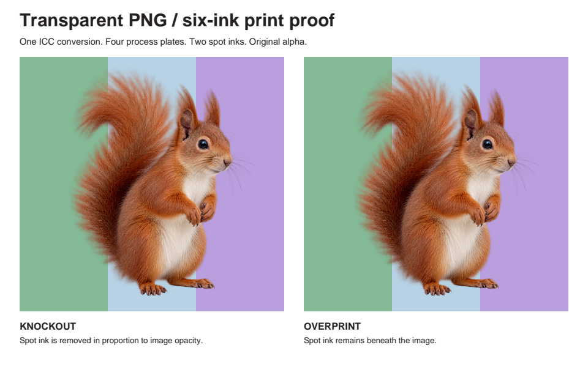
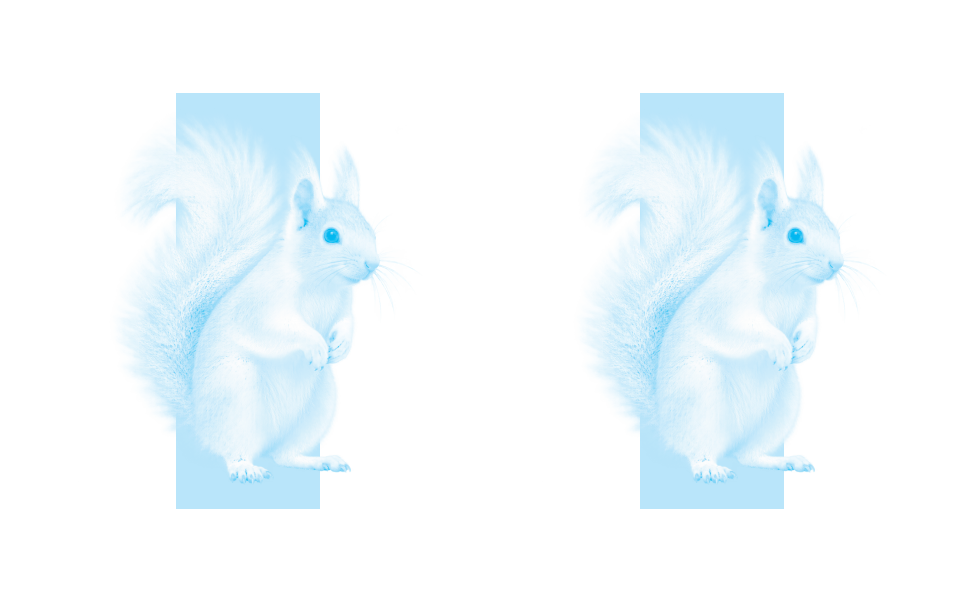
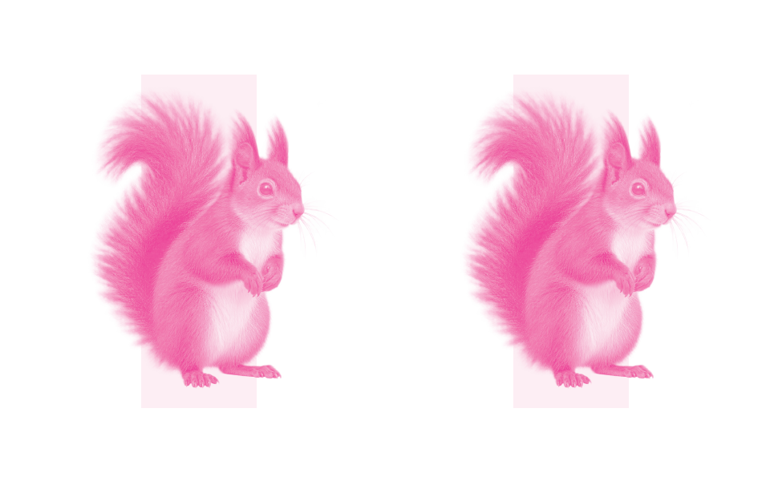
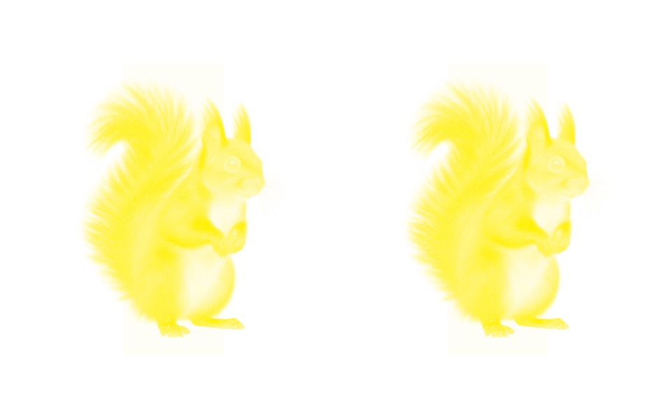
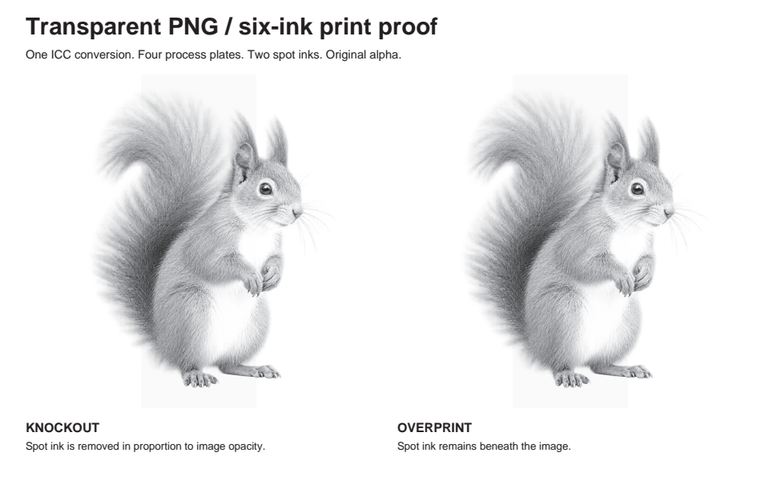
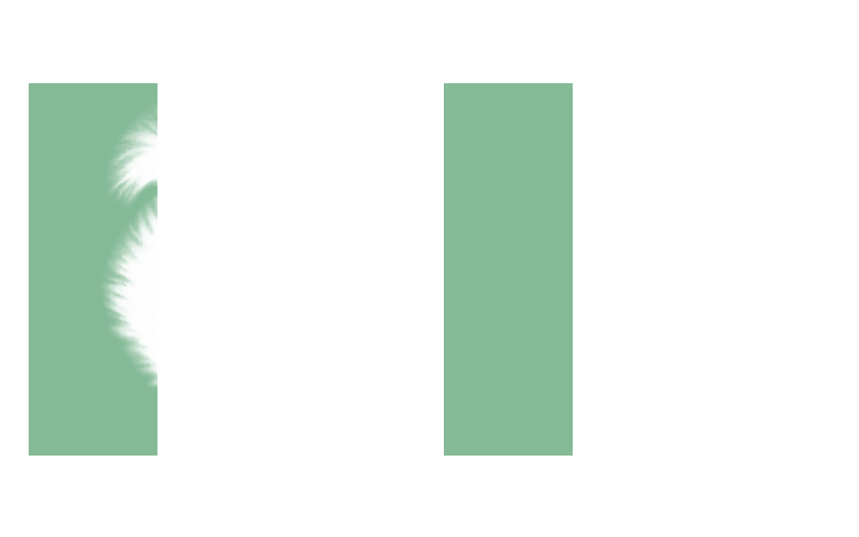

# Images for print

Prepare PNG or JPEG files once with `prepareCmykImage()` from `mondrian.pdf/print`, then use the returned CMYK samples in the delivered PDF. Plate previews read those same samples; they never perform a second color conversion. The preparation entry point runs in Node.js and keeps image decoders and the LittleCMS WebAssembly engine out of the browser-compatible core entry point.

```ts
import { readFile, writeFile } from "node:fs/promises"
import { createPdfDocument, rectangle, serializePdf } from "mondrian.pdf"
import { prepareCmykImage } from "mondrian.pdf/print"
import { previewPdfPlates, renderPdf } from "mondrian.pdf/testing"

const profile = await readFile("printer-supplied-output.icc")
const prepared = await prepareCmykImage(await readFile("cut-out.png"), {
	destinationProfile: profile,
	// Omit when the file has a supported embedded profile or PNG sRGB declaration.
	sourceProfile: "srgb",
	renderingIntent: "relative-colorimetric", // Default.
	blackPointCompensation: true, // Default.
})
const pdf = createPdfDocument({
	outputIntent: { profile, identifier: "Printer's agreed output condition" },
})
const image = pdf.image(prepared)
pdf.setPages(
	pdf.page({
		mediaBox: rectangle(0, 0, 400, 400),
		content: [pdf.graphics((g) => g.drawImage(image, 20, 20, 360, 360))],
	}),
)
const document = pdf.compile()
await writeFile("delivery.pdf", serializePdf(document))
for (const plate of previewPdfPlates(document)) {
	const preview = await renderPdf(serializePdf(plate.document))
	await writeFile(`plate-${plate.name}.png`, preview.pages[0]!.png)
}
```

## Color policy

The destination must be a CMYK output ICC profile supplied for the intended printing condition. There is no default printing profile. The example uses a fixed CRPC6 fixture for reproducible tests; it is not a recommendation for every print job.

An embedded PNG `iCCP` or JPEG ICC profile supplies the source color interpretation. A PNG `sRGB` declaration selects sRGB. For untagged input, or a PNG described only by `gAMA`/`cHRM` or the currently unsupported `cICP` metadata, pass an explicit `sourceProfile`; otherwise preparation rejects the input. An explicit profile overrides embedded color interpretation, including `cICP`, so use `"srgb"` only when that is the intended interpretation. Conflicting PNG ICC and sRGB declarations are rejected. RGB and grayscale source ICC profiles are supported.

Rendering intents are `"perceptual"`, `"relative-colorimetric"`, `"saturation"`, and `"absolute-colorimetric"`. Preparation converts straight color samples through the selected profiles and returns interleaved 8-bit CMYK samples, with 0 meaning no ink and 255 full ink. It snapshots input/profile buffers and returns independently owned buffers. Exact separation values depend on the profiles and conversion engine; they are not a fixed cross-version numerical contract.

`pdf.image()` accepts `PdfCmykImageData`, requires a document output intent with identical profile bytes, and snapshots the prepared buffers. Reuse its owned image handle to place the image more than once. The core emits lossless DeviceCMYK samples, embeds the output profile, and specifies a CMYK page blending space. Output intents require PDF 1.4 or later. Declaring an output intent alone does not certify PDF/X conformance.

## Transparent PNGs

RGBA, grayscale with alpha, and palette/transparency PNGs preserve their per-pixel alpha. Color conversion never transforms alpha, multiplies color by alpha, or flattens the image onto white. In the PDF, alpha becomes an independent grayscale image soft mask. Fully transparent pixels leave underlying content untouched; partially transparent edges cover it proportionally. The opaque case needs no mask.

Normal knockout images remove underlying spot coverage according to their opacity. With `fillOverprint: true`, the CMYK image leaves spot plates untouched. Images always paint their process components, including zeros, in both overprint modes: the mode-1 zero-component exception applies to vector/text painting, not images.

## Supported inputs and preview boundaries

Preparation supports PNG sample depths up to 8 bits (including palette PNGs), and 8-bit RGB/grayscale JPEGs supported by the decoder. It rejects animated PNGs, 16-bit PNGs, CMYK JPEGs, unsupported profiles, and malformed color metadata. Inputs are bounded to 256 MiB, 32 million pixels, and 16 MiB per ICC profile. The existing `pdf.jpeg()` still embeds original RGB/gray JPEG data without conversion; use preparation when you need CMYK plate previews.

Plate previews support 8-bit DeviceCMYK Image XObjects with unfiltered or Flate-compressed samples, optional same-sized 8-bit DeviceGray image soft masks, and default or inverted Decode ranges. They preserve image placement, clipping, interpolation, and constant opacity with Normal blending. Explicit CMYK page transparency groups without knockout are supported. Other image codecs, predictors, color-key/stencil masks, matte colors, graphics-state soft masks, and Form transparency groups remain unsupported and fail during discovery.

The resulting proofs show the CMYK coverage encoded in the delivered file. They do not predict a printer's subsequent color conversion, trapping, screening, or the physical appearance of ink and paper. Inspect separate plates when checking overprint; the screen renderer's composite is not an overprint simulation.

## Rendered proof

The [executable example](../examples/print-images.ts) converts one transparent photographic PNG and places the same image twice over process color and two spot inks. The left placement knocks out; the right overprints. The [visual regression test](../tests/private/visual-regressions/print-images.test.ts) generates and verifies these committed artifacts through `mondrian.pdf/testing`.



| Cyan                                                                                                  | Magenta                                                                                                     |
| ----------------------------------------------------------------------------------------------------- | ----------------------------------------------------------------------------------------------------------- |
|  |  |

| Yellow                                                                                                    | Black                                                                                                   |
| --------------------------------------------------------------------------------------------------------- | ------------------------------------------------------------------------------------------------------- |
|  |  |

| Leaf Green spot                                                                                                   | Violet spot                                                                                               |
| ----------------------------------------------------------------------------------------------------------------- | --------------------------------------------------------------------------------------------------------- |
|  |  |
