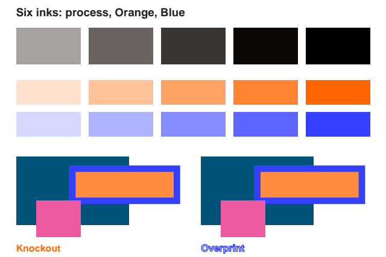
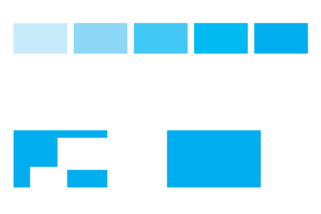
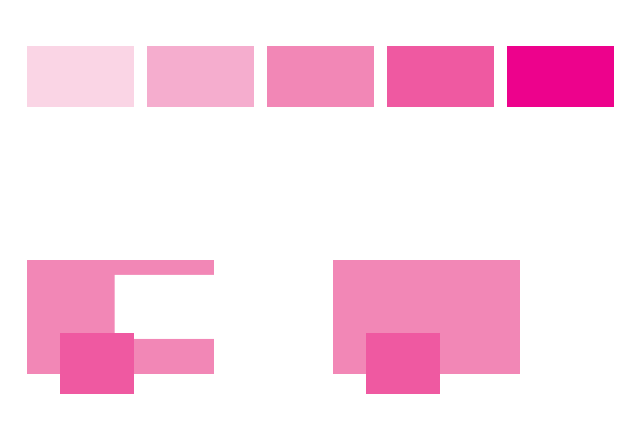
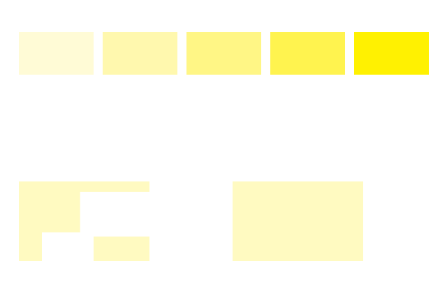
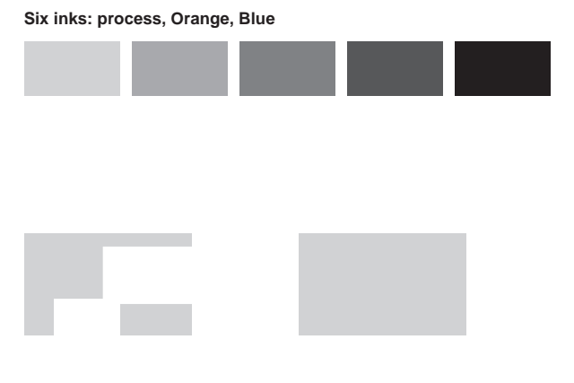
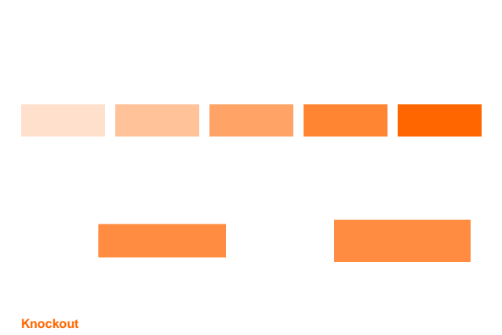
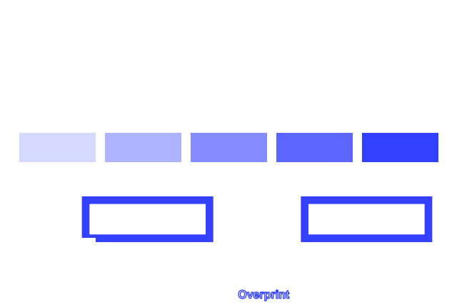

# Previewing print plates

`previewPdfPlates()` from `mondrian.pdf/testing` accepts a `PdfDocument`—the IR returned by the semantic builder's `compile()` or the object builder's `build()`—and returns an independent document for each plate. Use the existing renderer or artifact tools to view and compare them.

```ts
import { serializePdf } from "mondrian.pdf"
import { previewPdfPlates, renderPdf } from "mondrian.pdf/testing"

const plates = previewPdfPlates(pdf.compile(), {
	permitColors: ["cmyk", "spot"], // The default.
})

for (const { name, colorSpace, document } of plates) {
	const preview = await renderPdf(serializePdf(document))
	// name is Cyan, Magenta, Yellow, Black, or the exact spot ink name.
	// colorSpace is "cmyk" or "spot"; preview.pages contains PNGs and pixels.
}
```

The first pass discovers plates and validates painting across every page and invoked Form before producing any copies. When `"cmyk"` is permitted, the result always starts with Cyan, Magenta, Yellow, and Black, including empty plates. Each distinct spot name adds a plate in discovery order. Names are case-sensitive; identical alternate preview colors do not merge different inks. Conflicting definitions of the same ink name fail. For a spot-only job, pass `{ permitColors: ["spot"] }`; encountering any CMYK color then fails. An empty list permits only documents with no color declarations or visible painting.

Each preview retains its ink color: a process color keeps only the selected CMYK component, and a spot keeps its original tint and alternate preview definition. An RGB alternate for a spot is permitted because it describes that ink's preview, rather than RGB process painting. No RGB-to-CMYK or gray-to-black conversion is performed. RGB and gray painting—including PDF's implicit default gray black—fails with a page or Form diagnostic. Set black explicitly with `cmykFill(0, 0, 0, 1)` or `cmykStroke(0, 0, 0, 1)`.

Knockout objects still erase the covered area on other plates. Overprinting leaves unaddressed plates untouched; CMYK overprint mode 1 also preserves plates whose source component is zero. Mode 0 paints those zeros. A zero spot tint still paints its own plate in either mode. Fill and stroke are evaluated independently, including combined path painting and text rendering modes. Invisible text retains its advance and clipping text retains its clipping effect.

Page order, dimensions, rotation, metadata, text, paths, clipping, transforms, and Form bounding boxes are preserved. Repeated Form invocations share a projection when their inherited paint state and page resources match; different contexts receive separate projections. Unfiltered and Flate-compressed page/Form content is supported, including content produced by `bindColorContent()`, `compressColorContent()`, and `formColorContent()`. Constant fill/stroke opacity with Normal blending is preserved for object-level documents; the semantic builder still permits only opaque paint. Input data and returned documents do not share mutable byte buffers.

This initial version rejects images, inline images, patterns, shadings, Type3 fonts, annotations, optional-content painting, transparency groups, soft masks, non-Normal blend modes, default color-space replacements, special Separation names, and other unsupported content operators or graphics-state settings. Combined fill/stroke operations with unequal opacities are also rejected, including text rendering modes 2 and 6: their implicit knockout groups require preserving both channels' shapes even when one deposits no ink on a plate. Separate fill or stroke operations and combined operations with equal opacities remain supported. Text objects with the default text knockout (`TK=true`) are rejected when their painted glyphs use both transparency and overprinting, even if those settings occur on different glyphs: suppressing a glyph can lose its knockout shape. Opaque text, transparent text without overprinting, and text with `TK=false` remain supported. ICC, DeviceN, and other color spaces are unsupported. These checks apply before any preview is returned, so unsupported painting cannot silently disappear from a proof. As with other testing helpers, the input must be a valid Mondrian document; this is not an arbitrary-PDF import API.

The overlap rules follow the [Adobe PDF Reference 1.6, §4.5.6 and §7.6.3](https://opensource.adobe.com/dc-acrobat-sdk-docs/pdfstandards/pdfreference1.6.pdf). The previews expose described ink coverage using the existing renderer; printer color management, trapping, screening, and physical ink appearance are outside their scope. See the deterministic [six-ink example](../examples/print-plates.ts).

## Rendered example

These committed images are generated from the six-ink example through `mondrian.pdf/testing` and checked by the [visual regression test](../tests/private/visual-regressions/print-plates.test.ts). The upper rows show tint ramps; the lower shapes use knockout on the left and overprint on the right.



| Cyan                                                                                                        | Magenta                                                                                                           |
| ----------------------------------------------------------------------------------------------------------- | ----------------------------------------------------------------------------------------------------------------- |
|  |  |

| Yellow                                                                                                          | Black                                                                                                         |
| --------------------------------------------------------------------------------------------------------------- | ------------------------------------------------------------------------------------------------------------- |
|  |  |

| Orange spot                                                                                                          | Blue spot                                                                                                        |
| -------------------------------------------------------------------------------------------------------------------- | ---------------------------------------------------------------------------------------------------------------- |
|  |  |
